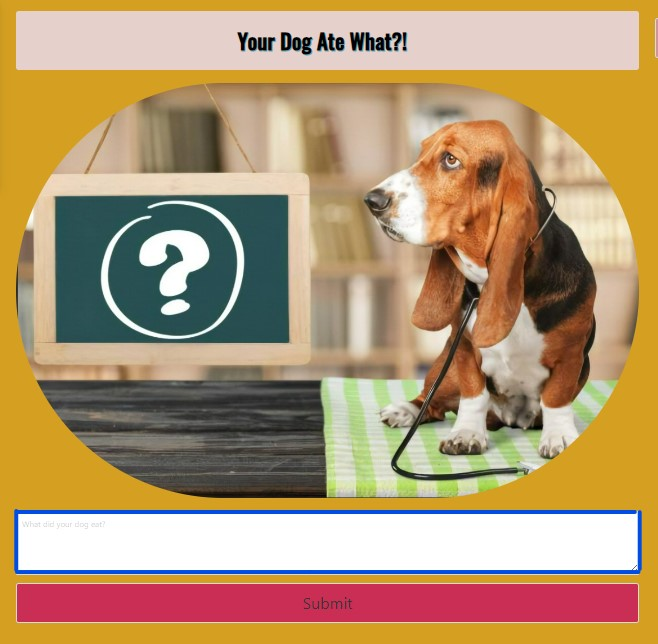
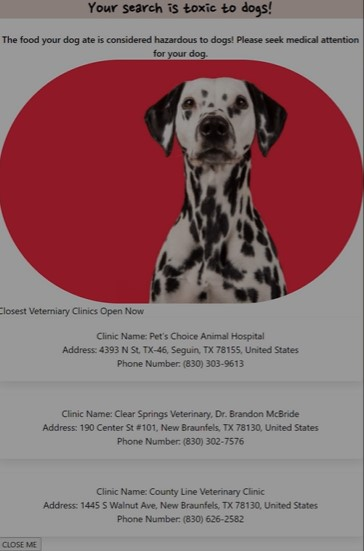

# Your Dog Ate What?

## Disclaimer 
DISCLAIMER: THIS WEBSITE DOES NOT PROVIDE MEDICAL ADVICE
The information, including but not limited to, text, graphics, images and other material contained on this website are for informational purposes only. No material on this site is intended to be a substitute for professional medical advice, diagnosis or treatment. Always seek the advice of your veterinarian or other qualified health care provider with any questions you may have regarding a medical condition or treatment and before undertaking a new health care regimen, and never disregard professional medical advice or delay in seeking it because of something you have read on this website.

## Product Description
Welcome to Your Dog Ate What?. This app will help you determine if something that your dog has eaten could be potentially hazardous. We will help you determine the risk level to your dog based on the ingrediants in the ingested food. If the ingested food poses a risk to your dog we will help you find the nearest open veterinarian office based on your location. 
## How to Use This Project
Navigate to https://adamwagh512.github.io/your-dog-ate-what/
### How to Use the Menu
On the left side of the screen, you will find our navigation menu. 
     
Click on the About Us tab to learn about the team that built this app.

Click on the Poison Index to access our poison index. Please refer to our poison index documentation below for more information about how to use this feature

Click on the Contact Us tab to send us an email

Click on the FAQs tab to access our frequently asked questions modal 

### How to use the Poison Index
1) Navigate to the poison index as described above and click on the link

2) This should generate an alphabetized list of known dog toxins. 

3) Search for the toxin that you are concerned about

4) If the toxin is in our database, you will see a threat 
level listed beside it as seen below.

5) If you do not see the toxin you are concerned about please contact your vet first, and then send us an email at yourpetatewhat@gmail.com so we research the toxin and add it to our database if needed.

### How To Use the Search Bar
1) Type what your dog ate into the search bar and click the Submit button below the search bar. Your recent searches will appear on the right hand side of the page.
 

2) Your results will pop up in a modal as seen below. If a vet visit is recommended we will provide you with options for the nearest open vet offices.

    
    
3) You can either click one of the links to the vet offices or click the close button to return to the landing page. 
## Credits
### Technologies Used 
1) HTML
2) Javascript
3) CSS
4) Bulma was used for styling this page https://bulma.io/
### APIs Used
1) Chomp Food Data API- Ingrediants List
2) Google Maps - Javascript API

### Animal Toxin Data 
Animal toxin data was pulled from https://www.petpoisonhelpline.com/poisons/

## Contributers
Kurt Bixby - Github: kurtbixby
    
Marian Croitoru - Github: marianfediuc

Sierra Nutt - Github: SierraNN

Adam Wagh - Github: adamwagh512

Callie Williams - Github: calliebwill

## Licences 
MIT License

Copyright (c) 2022 adamwagh512

Permission is hereby granted, free of charge, to any person obtaining a copy
of this software and associated documentation files (the "Software"), to deal
in the Software without restriction, including without limitation the rights
to use, copy, modify, merge, publish, distribute, sublicense, and/or sell
copies of the Software, and to permit persons to whom the Software is
furnished to do so, subject to the following conditions:

The above copyright notice and this permission notice shall be included in all
copies or substantial portions of the Software.

THE SOFTWARE IS PROVIDED "AS IS", WITHOUT WARRANTY OF ANY KIND, EXPRESS OR
IMPLIED, INCLUDING BUT NOT LIMITED TO THE WARRANTIES OF MERCHANTABILITY,
FITNESS FOR A PARTICULAR PURPOSE AND NONINFRINGEMENT. IN NO EVENT SHALL THE
AUTHORS OR COPYRIGHT HOLDERS BE LIABLE FOR ANY CLAIM, DAMAGES OR OTHER
LIABILITY, WHETHER IN AN ACTION OF CONTRACT, TORT OR OTHERWISE, ARISING FROM,
OUT OF OR IN CONNECTION WITH THE SOFTWARE OR THE USE OR OTHER DEALINGS IN THE SOFTWARE.